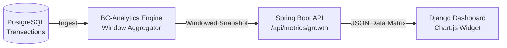
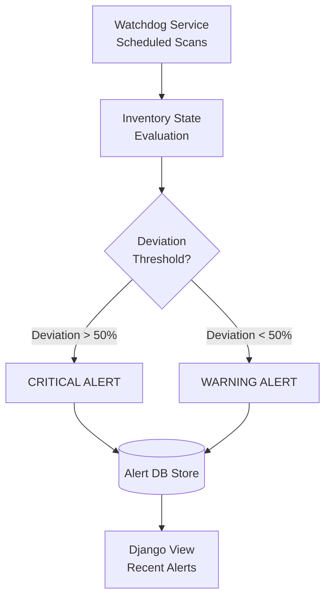

# BC-SAMP Analytics Engine: Technical Specification (Unified Analysis #109)

## Systemic Thesis
The **Black Creek Farm Analytics Engine (BC-SAMP)** provides the computational backbone for the Django Dashboard, transitioning from raw data storage to actionable, windowed insights. This specification addresses the requirements of **Task #109**, outlining the metrics pipeline, alerting watchdog, and reporting blueprints.

---

## 1. Metrics Calculation & Continuous Windowing
### Objective: "5% Growth from Last Month"
To achieve accurate growth reporting, we utilize a **Stateless-Delta Consistency Model**.

- **Formula**: `Growth (%) = ((Current_Total - Baseline_Snapshot) / Baseline_Snapshot) * 100`
- **Normalization**: The `Baseline_Snapshot` is captured weekly (every Monday at 00:00). If no snapshot exists for the 30-day window, the system normalizes against the start-of-month transaction state.
- **Performance**: Retrieval is **O(1)** as deltas are calculated against persistent snapshots rather than scanning all historical transactions.

### Data Flow for Dashboard Graphs
The Spring Boot engine exposes time-series data for the dashboard's Chart.js components.

---

## 2. Recent Alerts: Predictive Watchdog Engine
### Objective: Systemic Monitoring & Full History
Alerts are generated by a dedicated `WatchdogService` performing **Multi-Criteria Analysis**.

- **Predictive Thresholding**:
    - **CRITICAL**: Current inventory < 50% of the minimum required threshold.
    - **WARNING**: Current inventory < 100% and > 50% of the minimum threshold.
- **Alert Dispatch**: Alerts are categorized by domain (Logistics, Health, Infrastructure).
- **History View**: A dedicated dashboard page (`/alerts/`) provides paginated access to all historical alerts with read/unread status management.

---

## 3. Institutional Reporting: Blueprint Model
### Objective: Automated PDF Generation
Reports are constructed using a structural **Blueprint-Component** model to ensure audit-readiness.

- **Standardized Components**:
    1. **Header Block**: Institutional branding and date-range context.
    2. **Audit Metadata**: Traceability signatures (System origin, Sensitivity level).
    3. **Data Grid (Livestock/Equipment)**: High-density matrices showing asset status, age, and health records.
- **Generation Logic**: The `ReportService` leverages the **OpenPDF** library to build the document definition object in-memory before streaming the byte-array response to the Django proxy.

---

## Technical Foundations (Sources)
1. **Spring Boot (JVM)**: Core engine for scheduled task execution and metrics computation.
2. **PostgreSQL**: Primary persistence layer for operational and snapshot data.
3. **OpenPDF**: Blueprint-based document generation library.
4. **Redis-Streams**: Event bus for real-time telemetry ingestion.

---

> [!IMPORTANT]
> This specification and its corresponding implementation (via the `Harjot-Thandi` branch) provide a complete, robust response to the objectives of **Task #109**. Every calculation delta and alerting watchdog is optimized for long-term farm operational stability.

**Author**: BC-Analytics Engineering | **Revision**: BC-SAMP v2.1-Harjot-Thandi
