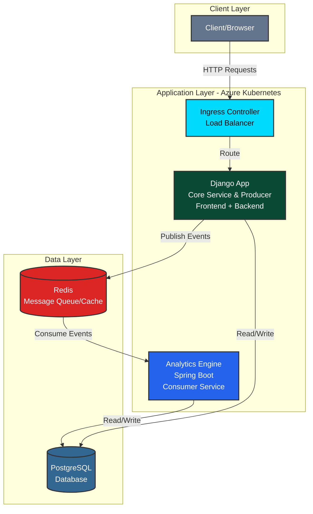
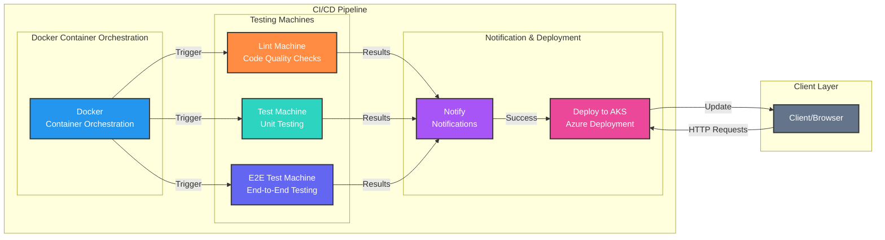

# Blackcreek DBMS

Django & Spring Boot based database management system with PostgreSQL, Redis.

[](https://github.com/yublueprint/blackcreek_dbms)

---

## Table of Contents

- [Quick Start](#quick-start)
- [Database Setup](#database-setup)
- [Development Commands](#development-commands)
- [Troubleshooting](#troubleshooting)
- [Contributing](#contributing)
- [System Architecture](#system-architecture)

---

## Quick Start

**Prerequisites:** Python 3.8+, Docker, Docker Compose, Git

> **Static files note (important):**
> When running `make run`, if prompted to collect static files, enter **`yes`**.
> When `DEBUG = False` in `settings.py`, Django **does not automatically serve static files** (it assumes a web server like **NGINX** will handle them). This is something we still need to investigate/standardize.
>
> **Migration note:**
> If you see any migration warnings, run migrations before continuing:
> - macOS/Linux: `make migrate`
> - Windows: `python manage.py migrate`

<table>
<tr>
<th width="50%">macOS/Linux</th>
<th width="50%">Windows</th>
</tr>
<tr>
<td valign="top">

```bash
git clone https://github.com/yublueprint/blackcreek_dbms.git
cd blackcreek_dbms

make build
make migrate
make run
make signup
make test
make lint
make lint-fix
```

</td>
<td valign="top">

```bat
git clone https://github.com/yublueprint/blackcreek_dbms.git
cd blackcreek_dbms

python -m venv venv
venv\Scripts\activate
pip install -r requirements.txt
python manage.py migrate
python manage.py collectstatic
python manage.py runserver
python manage.py createsuperuser
```

</td>
</tr>
</table>

**Access:** [http://127.0.0.1:8000](http://127.0.0.1:8000)

---

## Database Setup

```bash
docker compose up -d      # Start
docker compose down       # Stop
docker compose down -v    # Stop + delete data
```

| Service | URL | Credentials | Purpose |
|---------|-----|-------------|---------|
| Django App | [localhost:8000](http://127.0.0.1:8000) | Via signup | Main application |
| PostgreSQL | localhost:5433 | **user:** `user` <br> **password:** `user` | Primary database |
| pgAdmin | [localhost:5050](http://localhost:5050) | **email:** `admin@blackcreek.com` <br> **password:** `admin` | Database management |
| Redis | localhost:6379 | No authentication | Caching & sessions |
| Redis Commander | [localhost:8081](http://localhost:8081) | No authentication | Redis monitoring |

### Redis Configuration

Redis is used for background tasks.

**Test Redis connection:**
```bash
redis-cli ping
# Should return "PONG"
```

**Trigger analytics manually:**
```bash
redis-cli lpush analytics_events '{ "event": "Hello, Black Creek Farm!" }'
```

---

## Development Commands

**Environment Reset:**
- macOS/Linux: `make clean && make build && make migrate`
- Windows: Delete venv folder, recreate with `python -m venv venv`

---

## Troubleshooting

**Common Issues:**

| Problem | Fix |
|---------|-----|
| Port 8000 in use | Kill process or change port: `sudo lsof -i :8000` → `sudo kill -9 PID` |
| Database error | Check `docker compose ps` |
| Permission denied | Use `sudo` or add user to docker group |
| Staticfiles not updating. | make clean && make build |

---

## Contributing
### Before pushing changes
```bash
make test
make lint-fix
make lint
```
### Push changes
```bash
git checkout -b feature/your-feature
git commit -m "Add feature" -m "Description"
git push origin feature/your-feature
# Open pull request
```

---

## System Architecture

### Application Architecture



### CI/CD Pipeline


---

**Questions?** [Open an issue](https://github.com/yublueprint/blackcreek_dbms/issues) | Part of YU Blueprint initiative
